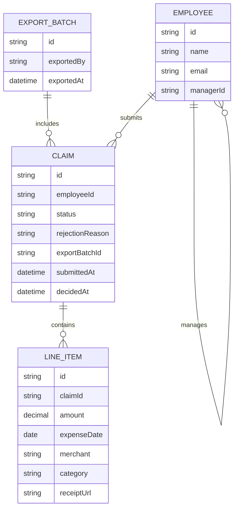

# Domain model

The core entities behind expense claims: an employee submits a claim made of
one or more line items, a claim is approved or rejected as a whole by the
employee's manager, and finance groups approved claims into export batches.

- `CLAIM.status` is one of `pending`, `approved`, `rejected`. A rejected claim
is edited in place and resubmitted, so it returns to `pending`.
- `LINE_ITEM.category` is one of the fixed company categories (Travel, Meals,
Lodging, Supplies, Other).
- `CLAIM.exportBatchId` is set the moment a claim is included in an export,
which is what excludes it from every later export.