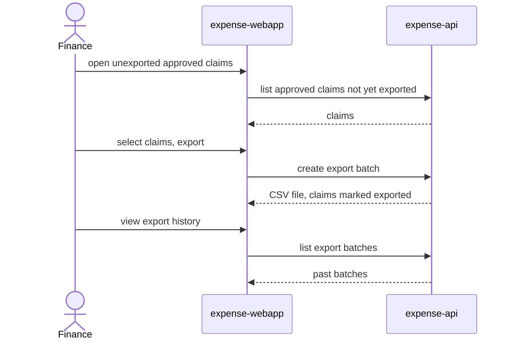

# Export approved claims to payroll

Finance reviews approved claims not yet exported, and exports a batch as a
CSV file, which locks those claims out of any later export.

```mermaid
sequenceDiagram
    actor Finance
    participant expense-webapp
    participant expense-api

    Finance->>expense-webapp: open unexported approved claims
    expense-webapp->>expense-api: list approved claims not yet exported
    expense-api-->>expense-webapp: claims
    Finance->>expense-webapp: select claims, export
    expense-webapp->>expense-api: create export batch
    expense-api-->>expense-webapp: CSV file, claims marked exported
    Finance->>expense-webapp: view export history
    expense-webapp->>expense-api: list export batches
    expense-api-->>expense-webapp: past batches
```