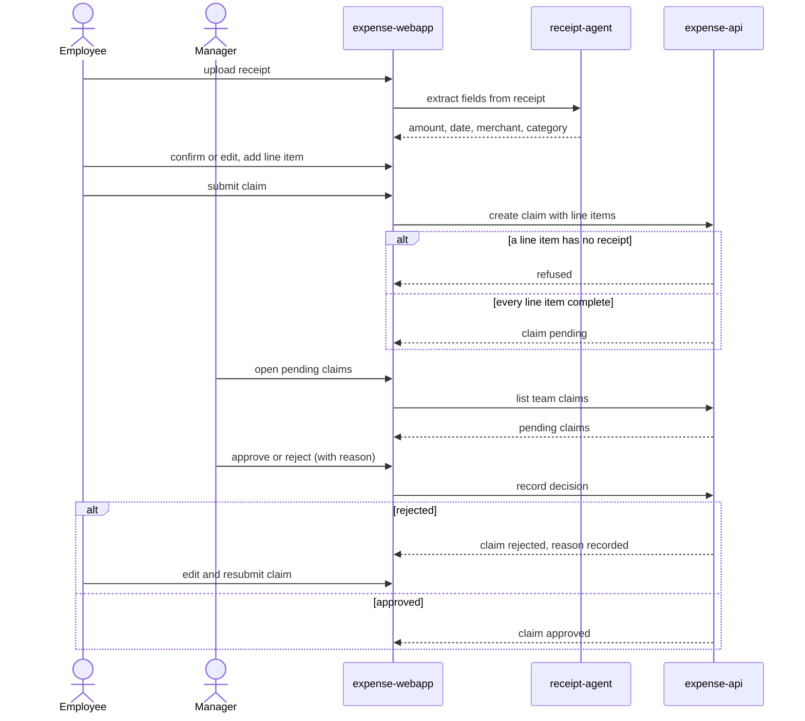

# Submit and approve a claim

An employee drafts a claim, letting an agent pre-fill each line item from its
receipt, submits it, and their manager approves or rejects it as a whole.

```mermaid
sequenceDiagram
    actor Employee
    actor Manager
    participant expense-webapp
    participant receipt-agent
    participant expense-api

    Employee->>expense-webapp: upload receipt
    expense-webapp->>receipt-agent: extract fields from receipt
    receipt-agent-->>expense-webapp: amount, date, merchant, category
    Employee->>expense-webapp: confirm or edit, add line item
    Employee->>expense-webapp: submit claim
    expense-webapp->>expense-api: create claim with line items
    alt a line item has no receipt
        expense-api-->>expense-webapp: refused
    else every line item complete
        expense-api-->>expense-webapp: claim pending
    end

    Manager->>expense-webapp: open pending claims
    expense-webapp->>expense-api: list team claims
    expense-api-->>expense-webapp: pending claims
    Manager->>expense-webapp: approve or reject (with reason)
    expense-webapp->>expense-api: record decision
    alt rejected
        expense-api-->>expense-webapp: claim rejected, reason recorded
        Employee->>expense-webapp: edit and resubmit claim
    else approved
        expense-api-->>expense-webapp: claim approved
    end
```